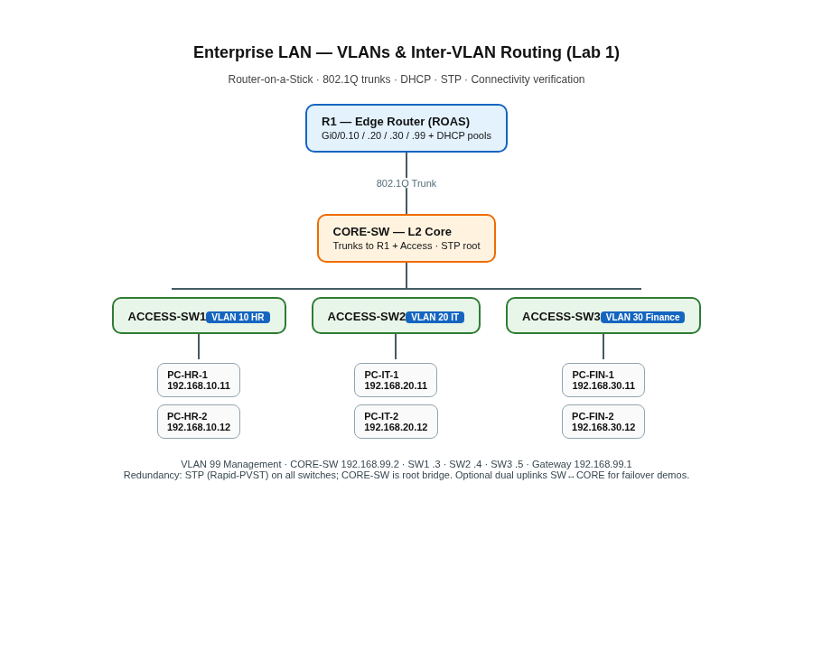

# LAB 1: Enterprise LAN with VLANs and Inter-VLAN Routing

Recruiter-facing **Cisco Packet Tracer** lab: department VLANs, 802.1Q trunking, router-on-a-stick inter-VLAN routing, per-VLAN DHCP, STP-based redundancy, connectivity tests, and **deliberate break → troubleshoot** drills.

| | |
| --- | --- |
| **Author** | [Kazi Nafis Nawaz](https://github.com/kn2702-sys) · MCA (Networking) |
| **Platform** | Cisco Packet Tracer (NetAcad) |
| **Skills** | VLAN · Trunk · ROAS · DHCP · STP · ICMP troubleshooting |
| **Series** | **LAB 1** · [LAB 2](https://github.com/kn2702-sys/dhcp-dns-failure-lab) · [LAB 3](https://github.com/kn2702-sys/LAB-3-Multi-Router-OSPF-Network) · [LAB 4](https://github.com/kn2702-sys/LAB-4-ACL-NAT-Internet-Edge) · [LAB 5](https://github.com/kn2702-sys/LAB-5-Site-to-Site-VPN-Firewall) · [LAB 6](https://github.com/kn2702-sys/LAB-6-Wireshark-NOC-Troubleshooting) · [LAB 7](https://github.com/kn2702-sys/LAB-7-NOC-Incident-Simulation) |
| **Status** | Docs + device configs complete · rebuild in Packet Tracer |

> Portfolio / learning lab — not a claim of production employment.

---

## Objective

Build a small company network with:

- 3 departments (HR, IT, Finance)
- VLAN segmentation + management VLAN
- DHCP per VLAN
- Inter-VLAN routing (router-on-a-stick)
- Switch trunking (access ↔ core ↔ router)
- Basic redundancy (STP; CORE-SW as root)
- Connectivity verification
- Intentional faults and a fixed troubleshooting sequence

---

## Topology



```text
                    Router (R1)
                       |
                  802.1Q Trunk
                       |
                  Core Switch
                 /     |      \
                /      |       \
           Access SW1  SW2     SW3
              |         |        |
           VLAN 10    VLAN 20  VLAN 30
           HR          IT      Finance
```

Full cabling and device list: see comments in `configs/vlan-config.txt` and `configs/router-config.txt`.

---

## VLAN / IP plan

| VLAN | Department | Network | Gateway (R1) | DHCP pool |
| ---: | --- | --- | --- | --- |
| 10 | HR | `192.168.10.0/24` | `192.168.10.1` | `.11`–`.100` |
| 20 | IT | `192.168.20.0/24` | `192.168.20.1` | `.11`–`.100` |
| 30 | Finance | `192.168.30.0/24` | `192.168.30.1` | `.11`–`.100` |
| 99 | Management | `192.168.99.0/24` | `192.168.99.1` | SVIs static (see below) |

**Management SVIs:** CORE `.2` · SW1 `.3` · SW2 `.4` · SW3 `.5`

---

## What you configure

### Switches (CORE + ACCESS-SW1/2/3)

- VLAN creation (10, 20, 30, 99)
- Access ports per department
- Trunk ports (802.1Q) toward core / router
- Management VLAN SVIs + default gateway
- STP: Rapid-PVST; CORE-SW priority so it is root

### Router (R1)

- Subinterfaces with `encapsulation dot1Q`
- Default gateways per VLAN
- DHCP pools per user VLAN (excluded gateways)

### Then break it deliberately

Wrong VLAN, bad trunk, wrong subnet/gateway, DHCP misconfig, wrong subinterface VLAN ID — full drills in [`troubleshooting.md`](troubleshooting.md).

---

## Troubleshooting sequence (use this order)

```text
Check physical/link
       ↓
Check VLAN
       ↓
Check access/trunk port
       ↓
Check IP
       ↓
Check gateway
       ↓
Check routing
       ↓
Test connectivity
```

---

## Quick start (Packet Tracer)

1. Place devices: 1 router, 1 core L2 switch, 3 access switches, 6 PCs.
2. Cable as in the topology diagram (router↔core trunk; core↔each access trunk; PCs on access ports).
3. Paste `configs/vlan-config.txt` sections into each switch CLI.
4. Paste `configs/router-config.txt` into R1.
5. Set PCs to DHCP; verify cross-VLAN ping (HR → IT → Finance).
6. Run faults from `troubleshooting.md`.
7. Drop proof screenshots into `screenshots/` (checklist inside that folder).

**No binary `.pkt` is committed** — configs + docs are the source of truth (`.pkt` is gitignored if you save one locally).

---

## Interview questions this lab prepares

| Question | Where to look |
| --- | --- |
| What is a VLAN? | README VLAN plan + `configs/vlan-config.txt` |
| Why use trunk ports? | Core↔access and core↔router links |
| What if native VLAN is wrong? | `troubleshooting.md` Fault F |
| How can two VLANs communicate? | R1 ROAS subinterfaces |
| What is router-on-a-stick? | `configs/router-config.txt` |
| Why same-VLAN works but other VLAN fails? | Missing trunk / wrong gateway / wrong subinterface VLAN ID |

Model answers: [`INTERVIEW.md`](INTERVIEW.md)

---

## Repository layout

```text
enterprise-vlan-lab/
├── README.md
├── topology.png
├── vlan-config.txt
├── router-config.txt
├── troubleshooting.md
├── INTERVIEW.md
├── BUILD.md
├── screenshots/
├── LICENSE
└── .gitignore
```

---

## Related lab

Broader HQ + WAN lab: [enterprise-network-design-lab](https://github.com/kn2702-sys/enterprise-network-design-lab)

---

## License

MIT © 2026 Kazi Nafis Nawaz — see [`LICENSE`](LICENSE).

## Contact

- GitHub: [kn2702-sys](https://github.com/kn2702-sys)
- LinkedIn: [kazi-nafis-nawaz-55b670393](https://www.linkedin.com/in/kazi-nafis-nawaz-55b670393)
- Email: kn2702@srmist.edu.in

